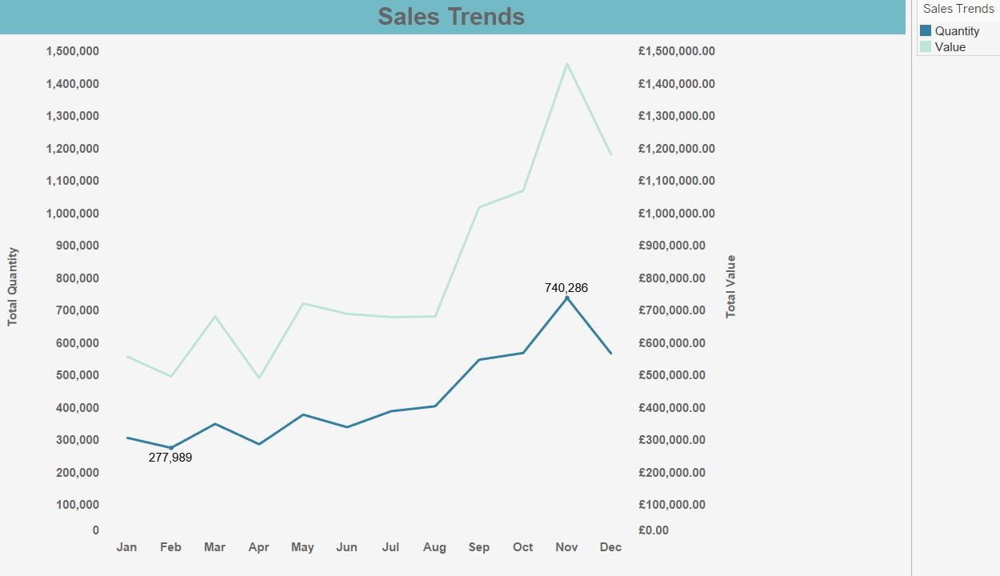
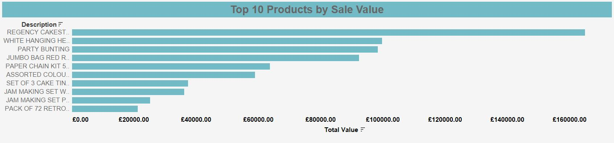
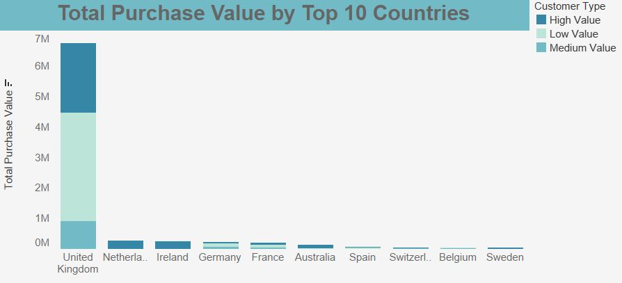

# E-Commerce Data Analysis

 

## Introduction
Welcome to the E-Commerce Data Analysis project! This project provides an in-depth analysis of e-commerce transaction data, focusing on understanding customer behavior, product performance, and sales trends to drive strategic business decisions.

## Problem Statement
The objective of this analysis was to uncover actionable insights from e-commerce transaction data to:
- Identify top-selling products and revenue drivers
- Analyze customer spending variations across categories
- Detect seasonal trends and patterns of behavior
- Understand high-value customers and their purchasing behaviors
- Assess sales performance across different geographical regions

## Skills Demonstrated
Throughout this project, I demonstrated proficiency in:
- Descriptive Analysis 📊
- Segmentation Analysis 🔍
- Exploratory Data Analysis (EDA) 📈
- Predictive Analysis 🔮
- Business Intelligence (BI) Techniques 📉
- Data Visualization 📉
- ETL (Extract, Transform, Load) 🔄
- Data Transformation 🔧
- Data Modeling 📐
- Calculated Fields 🔢

## Data Sourcing
The data for this analysis was acquired from a comprehensive e-commerce dataset, which includes:
- Sales records
- Customer information
- Product details
- Regional sales data

This dataset provides an extensive view of transaction dynamics and customer behavior.

## Data Transformation
The data was cleaned and transformed to ensure accuracy and consistency:
- **Removed duplicates** and handled missing values
- **Standardized** data formats
- **Aggregated** data by product categories and regions

## Modelling
Key models and metrics were developed to analyze performance:
- **Customer Segmentation**: Categorized customers into Low, Medium, and High Value
- **Sales Forecasting**: Used historical data to predict future sales trends

## Analysis & Visualization
Key analyses were performed using Tableau and SQL:
- **Sales Trends Over Time**: Identified peaks and troughs in sales and seasonal patterns
- **Top-Selling Products**: Analyzed product performance by revenue and quantity
- **Segmented Purchase Analysis**: Segmented customers by total purchase value (Low, Medium, High) and included regional performance insights
- **Summary KPI's**: Consolidated key metrics such as Total Revenue, Average Order Value (AOV), Customer Lifetime Value (CLV), and Retention Rate

### Key Findings

| Metric                      | Value                 |
|-----------------------------|-----------------------|
| **Top-Selling Product**     | Regency Cakestand (£164,000) |
| **Average Order Value (AOV)** | £52.30                |
| **Retention Rate**          | 87-92% Monthly        |
| **Customer Lifetime Value (CLV)** | £860.37           |

## Conclusion and Recommendations
Based on the analysis, the following recommendations were made:
- **Optimize Inventory Management**: Adjust inventory levels to align with identified seasonal sales trends.
- **Enhance Customer Retention**: Implement targeted campaigns and improve loyalty programs.
- **Increase Customer Lifetime Value (CLV)**: Focus on cross-selling and upselling strategies.
- **Investigate Sales Fluctuations**: Explore reasons behind significant sales spikes and drops.

### Screenshots and Visualizations

For interactive dashboards, check out the [Tableau Dashboard](https://public.tableau.com/views/E-commerceCustomerJourneySalesanalysis/Dashboard?:language=en-GB&:sid=&:redirect=auth&:display_count=n&:origin=viz_share_link) on Tableau Public.

## Links
- [Tableau Dashboard](Tableau_visuals/Customer_Journey&Sales_analysis.twbx)
- [Original Data Set](https://docs.google.com/spreadsheets/d/1c8WK008EwUROTsHSHolbZYLGvJedK3Xfo2hKzMYZJTY/edit?usp=sharing)

**The following processed datasets were used in the analysis**:

- [`customer_summary.csv`](https://docs.google.com/spreadsheets/d/1_VwWvUBht4Ikn0ewoHeRIj1J8u39dCgYQtvDMBO9Z98/edit?usp=sharing): This table provides a summary view of each customer, combining all transactions to allow for an analysis of individual customer metrics. It includes aggregated data such as total purchase value and average order value.

- [`transactions3_temp.csv`](https://docs.google.com/spreadsheets/d/1OxMLiy1Egf-_1UpeNtU9dhreGNMhL7vlRssbB78Z0b0/edit?usp=sharing): This table includes calculated fields for deeper analysis, such as total transaction value and customer segmentation. It consolidates individual transactions with additional metrics for comprehensive insights.

Feel free to explore the visualizations and analysis results in the provided Tableau dashboard and data files.

---

Happy analyzing!🤓 If you have any questions or need further details, please feel free to contact me.
